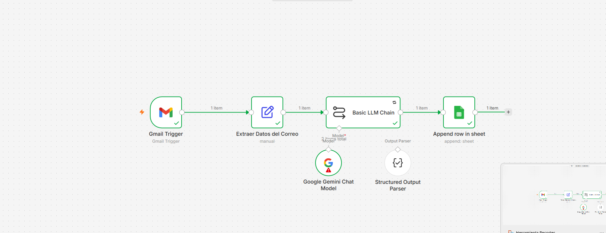
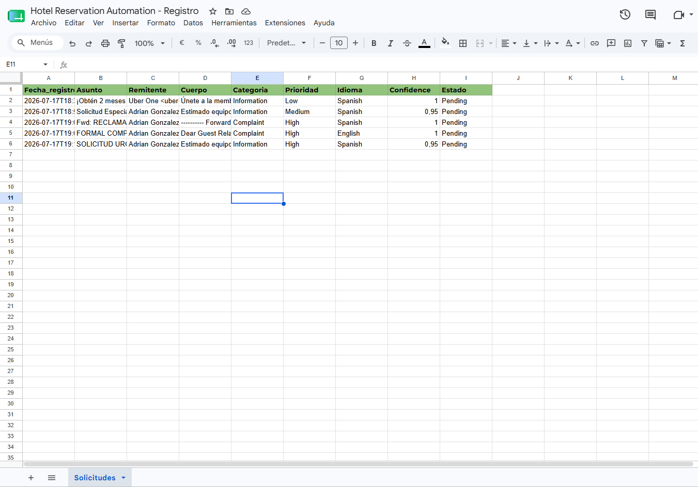
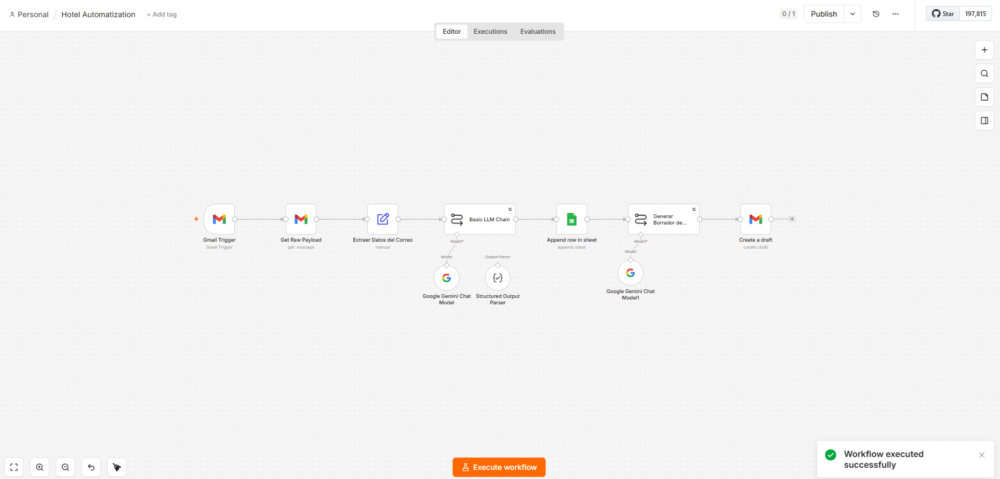
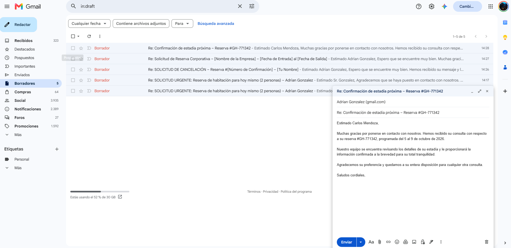

# hotel-reservation-automation

AI-powered automation platform for hotel reservation email processing using n8n, Gemini and Google Sheets

## Progreso técnico

- ✅ n8n corriendo localmente vía Docker
- ✅ OAuth de Gmail y Google Sheets configurado (Google Cloud)
- ✅ Workflow funcional: Gmail Trigger → extracción de asunto, remitente, cuerpo y fecha

### Capturas

!Workflow Gmail Trigger(screenshots/dia2-workflow-gmail-trigger.png)
!Resultado de extracción(screenshots/dia2-resultado-extraccion.png)

## Día 3 — Integración con IA

- ✅ Conectado Google Gemini (`gemini-3-flash-preview`) vía API key
- ✅ Prompt de clasificación diseñado con rol, reglas, categorías y ejemplos few-shot
- ✅ Salida JSON estructurada y validada con "Structured Output Parser"
- ✅ Workflow completo: Gmail Trigger → Extracción → Clasificación con IA (categoría, prioridad, idioma, confidence)

### Captura

!Clasificación JSON con Gemini](screenshots/dia3-clasificacion-json.png)

## Día 4 — Registro Automático

- ✅ Google Sheets creado y conectado vía OAuth
- ✅ 9 columnas diseñadas: fecha, datos del correo, clasificación de IA y estado
- ✅ Cada correo procesado genera automáticamente una fila estructurada
- ✅ Manejo de errores: Retry automático configurado ante fallos temporales de Gemini (503)
- ✅ Validado con múltiples correos de prueba (distintas categorías)

### Capturas

## Día 5 – Generación Automática de Respuestas y Flujo End-to-End

- [x] Configuración del modelo **Google Gemini** para la redacción de respuestas contextuales.
- [x] Integración de prompt para adaptar el tono cordial y profesional según el idioma y tipo de solicitud del cliente.
- [x] Conexión del nodo de **Gmail (`Create a Draft`)** para la creación automática de borradores.
- [x] Vinculación del hilo de conversación (`Thread ID`) y asunto dinámico para mantener la secuencia del correo original.
- [x] Resolución de bloqueo de permisos de la API (OAuth2 Scope & Cuota de almacenamiento en Google).
- [x] Pruebas y validación del flujo completo end-to-end: Recepción de correo → Extracción de datos → Clasificación estructurada con IA → Registro en Google Sheets → Generación de respuesta y borrador en Gmail.

### Capturas

## Día 6 – Exportación, Documentación y Versionado

- [x] Exportación de la lógica estructurada del flujo en formato JSON en `workflow/workflow.json`.
- [x] Finalización de la documentación del proyecto y actualización del repositorio en GitHub.

## 🔗 Repositorio del Proyecto
- **GitHub:** [hotel-reservation-automation](https://github.com/adriansamaca-create/hotel-reservation-automation)